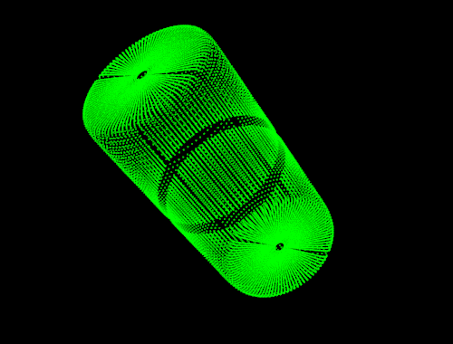

.. SQ documentation master file, created by
   sphinx-quickstart on Mon Jun 16 21:08:37 2014.

Super Quadric Fitting Documentation
===================================

   * :ref:`theoretical_background`

.. _theoretical_background:

Theoretical Background
----------------------

* :ref:`theory_primer`

========== ==========
|mi_0|     Title: **Theory Primer**

           Author: *A. Huaman Quispe*

           Compatibility: > PCL 1.6

           Superellipses, spherical product and superquadrics   
========== ==========

* :ref:`uniform_sampling`

========== ==========
|mi_1|     Title: **Uniform Sampling**

           Author: *A. Huaman Quispe*

           Compatibility: > PCL 1.6

           Explains the sampling approach used    
========== ==========

 

		     
	  
			   
..
   Local Variables:
   indent-tabs-mode: nil
   tab-width: 4
   End:
