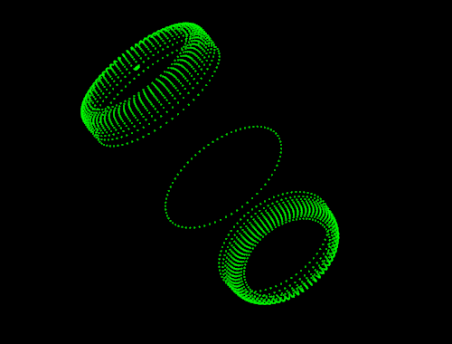
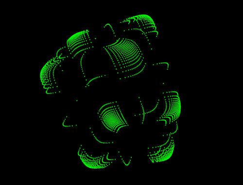
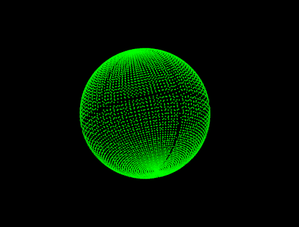
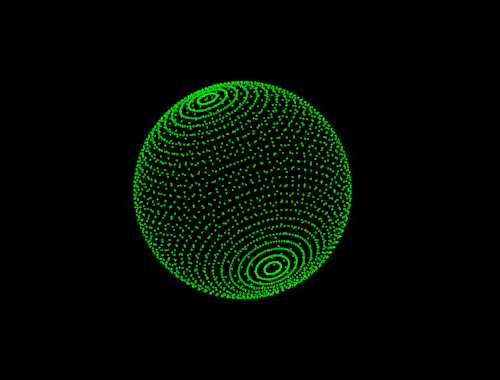
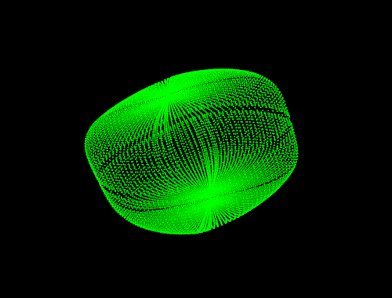
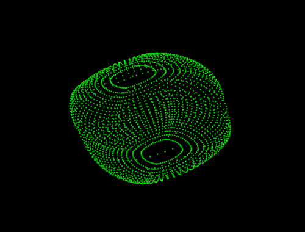

.. _uniform_sampling:

Super Quadric Sampling
----------------------

This tutorial will walk you through the sampling theoretical foundations 

+---------------+----------------+---------------+---------------+
| |su_se|       | |su_box|       | |su_cylinder| | |su_ball|     |
|               |                |               |               | 
| |eq_se|       | |eq_box|       | |eq_cyl|      | |eq_ball|     |         
+---------------+----------------+---------------+---------------+
| |sn_se|       | |sn_box|       | |sn_cylinder| | |sn_ball|     |
+---------------+----------------+---------------+---------------+
 

.. |eq_se| replace:: :math:`\epsilon_1=0.5,\epsilon_2=1.25`
.. |eq_box| replace:: :math:`\epsilon_1=0.2,\epsilon_2=0.2`
.. |eq_cyl| replace:: :math:`\epsilon_1=0.1,\epsilon_2=1.0`
.. |eq_ball| replace:: :math:`\epsilon_1=1.0,\epsilon_2=1.0`

.. |su_cylinder| image:: images/sampling_uniform_cylinder.png
			 :height: 90px

.. |su_box| image:: images/sampling_uniform_box.png
		    :height: 90px

			     

